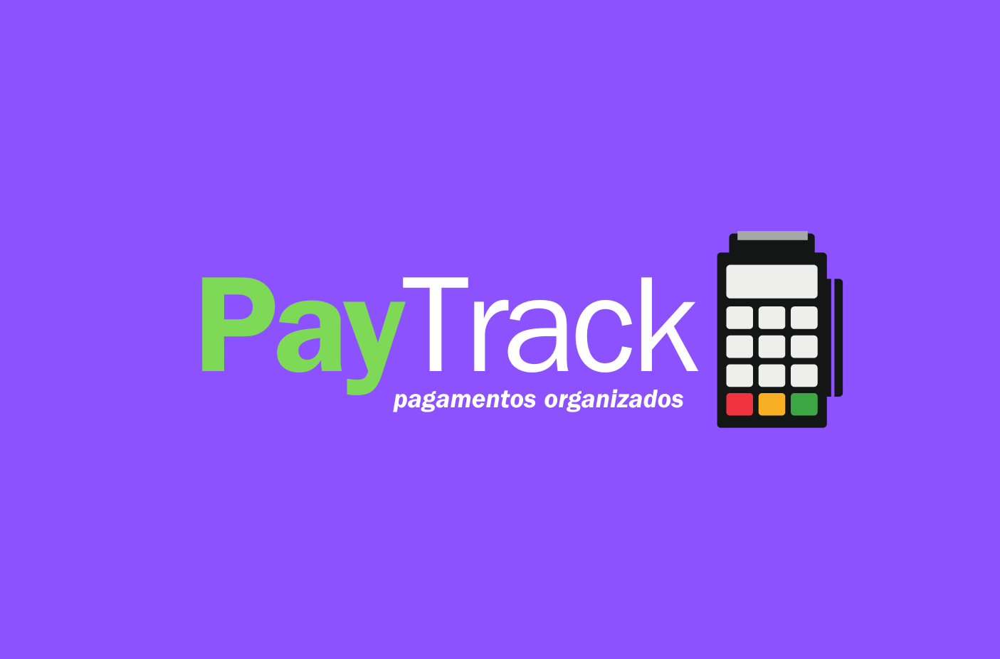

# 📑 PAY Track - API de Controle de Contas

## Descrição
A **PAY Track** é uma API desenvolvida para gerenciar um sistema de controle de contas. Com esta API, você pode criar, listar, atualizar e deletar contas. Foi implementada usando **FastAPI**, com validação e tratamento de erros utilizando **Pydantic**.

## 🛠️ Tecnologias Usadas
- **Python**: Linguagem de programação principal.
- **FastAPI**: Framework utilizado para desenvolver a API.
- **Pydantic**: Biblioteca utilizada para validação de dados.
- **Uvicorn**: Servidor ASGI usado para rodar a aplicação.
- **SQLAlchemy**: Utilizado para interação com o banco de dados.

## 🚀 Endpoints
- **POST /criarConta/**: Registra uma nova conta no sistema.
- **GET /listarContas/**: Retorna todas as contas cadastradas.
- **GET /pegarConta/{id_conta}**: Retorna os detalhes de uma conta específica.
- **PUT /atualizarConta/{id_conta}**: Modifica os dados de uma conta existente.
- **DELETE /deletarConta/{id_conta}**: Remove uma conta do sistema.

## 📂 Estrutura do Projeto
- **main.py**: Arquivo principal que contém as rotas e a lógica da API.